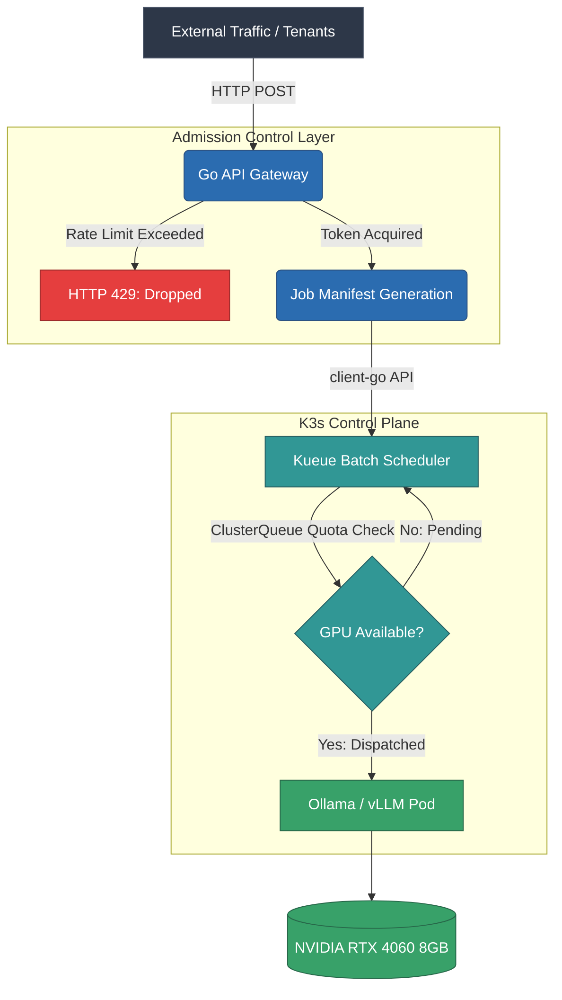

<div align="center">

# Robust Multi-Tenant Admission Control and Batch Scheduling for Resource-Constrained LLM Inference

[](#)
[](#)
[](#)

</div>

---

## Abstract
Commodity hardware presents a hostile environment for concurrent Large Language Model (LLM) inference due to severe VRAM and system memory bottlenecks. This repository proposes and implements a highly available, multi-tenant AI inference topology designed to operate strictly within the boundaries of an 8GB VRAM (NVIDIA RTX 4060) and 10GB System RAM environment. By decoupling request ingress from GPU execution via a custom Golang Token-Bucket API Gateway and Kubernetes (Kueue) batch scheduling, the system achieves zero Out-Of-Memory (OOM) evictions under high-concurrency traffic spikes.

---

## 1. System Topology

The architecture relies on an asynchronous handoff model. Ingress traffic is intercepted at the API Gateway layer, where algorithmic admission control drops excessive payloads before they can propagate to the Kubernetes Control Plane.


---
## 2. Algorithmic Admission Control

To prevent API saturation and protect the K3s scheduler from cascading failures, the Go Gateway implements a thread-safe Token Bucket algorithm using standard library `sync.Mutex` locks.

The admission logic ensures that each predefined `X-Tenant-ID` is strictly bound to a maximum concurrency rate.
*   **State Matrix:** The gateway maintains a dynamic mapping of tenant identifiers to isolated token buckets.
*   **Time Complexity:** Request validation executes in O(1) time, ensuring sub-millisecond latency at the ingress layer prior to Kubernetes API handoff.

---

## 3. Hardware Resource Determinism

Standard inference deployments assume elastic cloud resources. This environment is deliberately constrained to enforce resource determinism:

*   **Virtualization Barrier:** WSL2 GPU-PV (Paravirtualization) backend bypasses Linux kernel driver overhead, directly exposing the Windows host GPU to the K3s container runtime via Container Device Interface (CDI) generation.
*   **Memory Isolation:** Kubelet is configured with strict `cgroups` reservations (`--kube-reserved=cpu=500m,memory=1Gi`) to guarantee control plane survival during peak load.
*   **Inference Quantization:** The Llama-3-8B-Instruct model is strictly constrained to 4-bit quantization, with Kubernetes limits hardcoded to `6Gi` memory to prevent OOM termination.

---

## 4. Experimental Methodology & Empirical Results

### Objective
To empirically validate the resilience of the admission control layer and the queuing topology under hostile traffic conditions.

### Methodology
An asynchronous, multi-threaded load test was executed against the Gateway cluster IP.
*   **Payload:** $N=50$ concurrent HTTP POST requests.
*   **Duration:** $\Delta t \approx 1000\text{ms}$.
*   **Target:** `http://localhost:8080/v1/completions`

### Results & Artifacts
The Token Bucket algorithm successfully identified the burst, locking the Mutex and permitting the exact configured quota of requests to pass to the K8s API. The remaining 48 requests were instantly dropped at the network edge, preserving GPU stability.

**Artifact A: Edge Ingress Logs (The Shield)**
```text
Handling connection for 8080
429 Too Many Requests - GPU Protected
429 Too Many Requests - GPU Protected
...
Job llm-job-1783779323556903765 accepted and submitted to Kueue for tenant ClientA.
Job llm-job-1783779323562607163 accepted and submitted to Kueue for tenant ClientA.
429 Too Many Requests - GPU Protected
```

**Artifact B: Cluster Scheduler Logs (The Queue)**
The two permitted payloads were successfully transformed into Kubernetes Jobs. The Kueue orchestrator identified the single-GPU quota (`cluster-queue`) and successfully placed the jobs into execution state without exceeding hardware bounds.
```text
NAME                          STATUS    COMPLETIONS   DURATION   AGE
llm-job-1783779323556903765   Running   0/1           22s        23s
llm-job-1783779323562607163   Running   0/1           22s        23s
```

---

## 5. Deployment Instructions

### Prerequisites
*   Kubernetes distribution (K3s recommended for low memory footprint).
*   NVIDIA Container Toolkit installed and configured for `containerd`.
*   Kueue components installed in the cluster.

### Execution

**1. Apply the gateway RBAC and deployment manifests:**
```bash
kubectl apply -f gateway-deployment.yaml
```

**2. Forward the Gateway service port:**
```bash
kubectl port-forward svc/gateway-service 8080:8080 &
```

**3. Issue a test request:**
```bash
curl -X POST -H "X-Tenant-ID: ClientA" http://localhost:8080/v1/completions
```  
